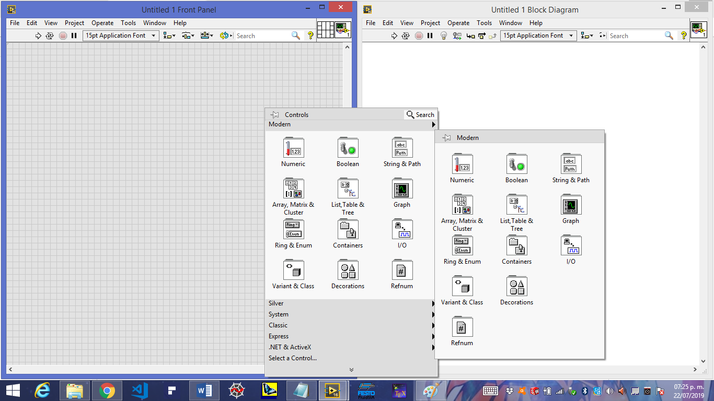
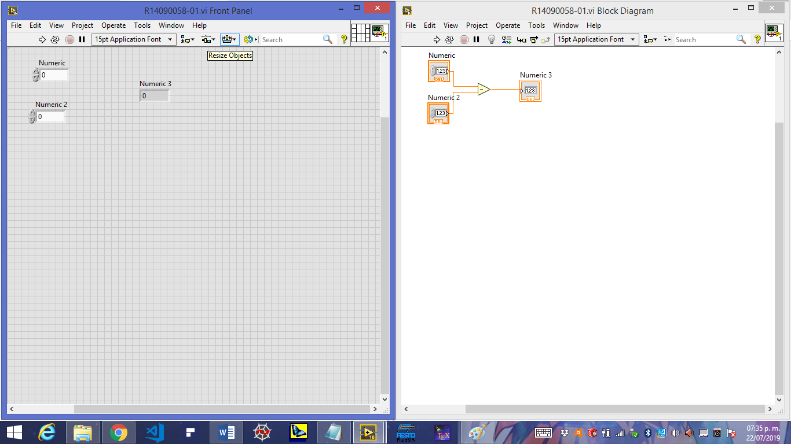
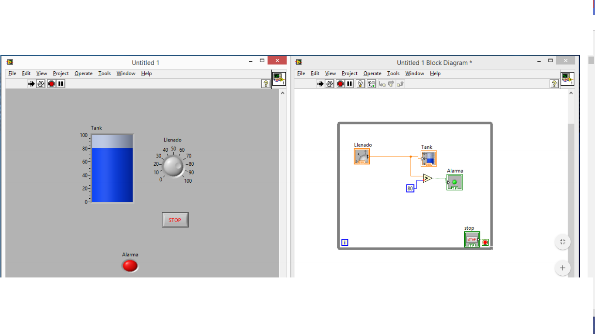
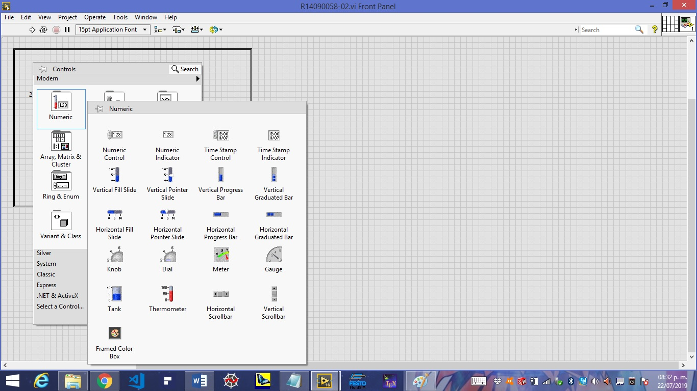
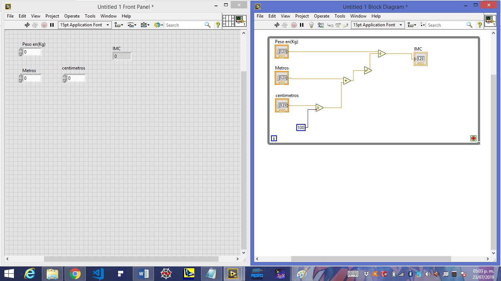
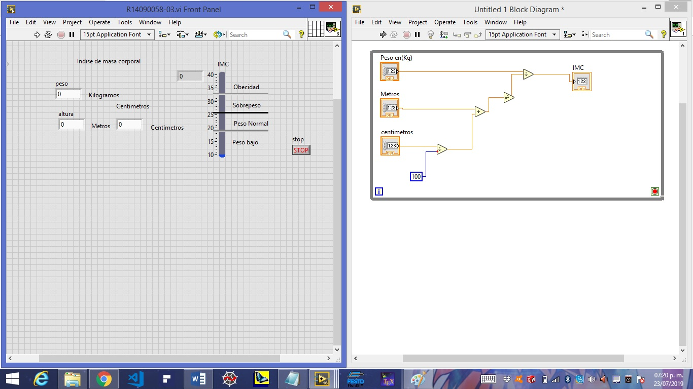
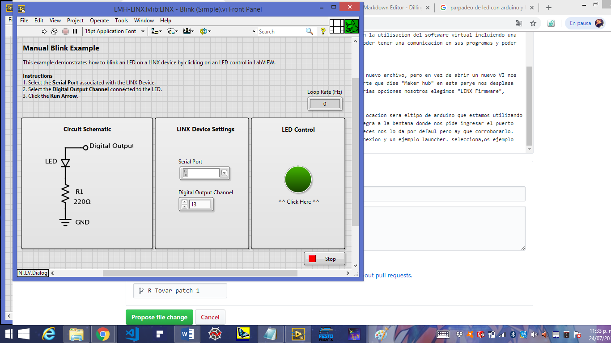
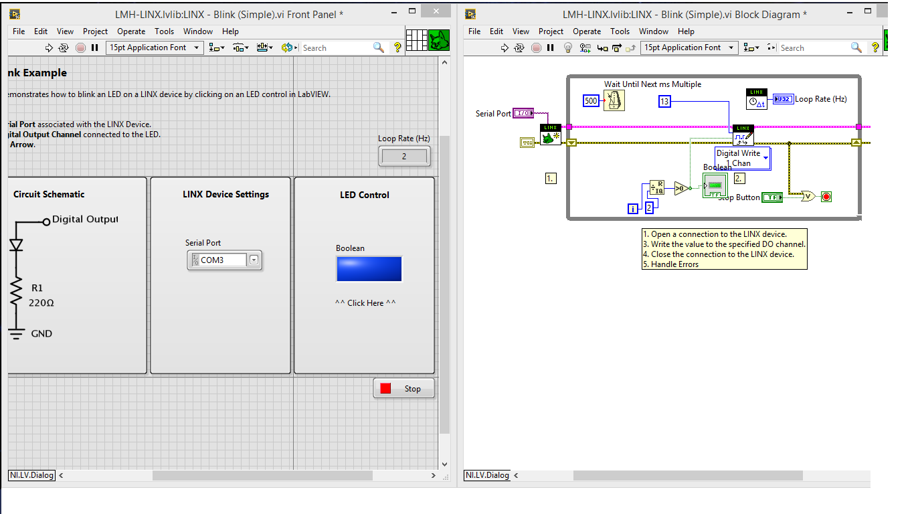

# control-de-procesos-R
### practicas de curso julio-agosto 2019
# Tecnologico de estudios superiores de Huixquilucan

### Ingenieria Mecatronica 

### Asignatura. Control de procesos 

### Asesor. Dr Enrique Garcia Trinidad 

### Alumno. Tovar Farfan Raul
### Control de procesos 
# practica 1
# Introduccion al LabVIEW 

LabVIEW (Laboratory Virtual Instrument Engineering Workbench) de National Instruments es
un ambiente de programación basado en programación gráfica y no en texto como lo son
lenguajes de programación tradicionales como C, C++ o java. Labview es un desarrollo de
programación interactivo y un sistema de ejecución diseñado para personas como científicos o
ingenieros que sin ser informáticos necesitan programar como parte de su trabajo. El ambiente
de desarrollo de Labview trabaja sobre computadoras Windows, Mac OS X, o Linux, además se
pueden crear programas que corren en una variedad de plataformas embebidas como FPGAs
(Field Programmable Gate Arrays), DSPs (Digital Signal Processors) y microprocesadores.
Usando el poderoso lenguaje de programación gráfico, Labview puede incrementar la
productividad, programas que toman semanas o meses en ser escritos en lenguajes de
programación convencionales pueden ser completados en horas usando Labview, ya que este
ha sido diseñado específicamente para realizar mediciones, analizar datos, y presentar
resultados al usuario en interfaces gráficas fáciles de programar, es ideal para simulaciones,
presentación de ideas, programación general e incluso para la enseñanza de conceptos básicos
de programación.
La computadora, hardware plug-in y Labview es lo que se necesita para realizar un instrumento
virtual completo, ofreciendo así una alternativa de mayor flexibilidad a los instrumentos
estándares de laboratorio, pues al estar basado en software será cada usuario y no el fabricante
del instrumento el que define la funcionalidad de este y si se necesita cambiar algo simplemente
se modifica el programa.

# Contenido
### Primer programa en labVIEW
Para poder iniciar con la programacion en LabVIEW y comenzar con nuesro primer programa es necesario ir explicando paso a paso los procedimientos a seguir como se muestra a continuacion.

1.- Ejecutando por primera vez LabView aparecerá un recuadro "Welcome to LabView el cual cancelaremos presionando (x) en la parte superior derecha, Para posteriormente abrir un nuevo VI como se muestra a continuación .

2.-una vez abierto el nuevo VI presionamos Ctrl+T para poder visualizar la parte virtual y la de diagrama de bloques, las cuales utilizaremos para construir mostró programa virtual de esta primer práctica

una vez aqui podemos Visualizar las herramientas que nos ofrece el programa en cada plano de las ventanas y de esta manera empezar a trabajar en el primer programa visualde esta curso.

3.-Entrandoen materia, Lo que prosigue es arrastrar 2 ventanas de control u un indicador, para de esta forma poder variar los números que se van a restar y el indicador en sonde se mostrara el resultado de la operación.
De esta manera tenemos como resultado un restador el cual al cambiarle la operación puede ser una suma, multiplicación, división o cualquier otro operador.
.

# practica 2
### insteumentoa virtuales

# Introduccion
Los ficheros generados con Labview se llaman Instrumentos Virtuales (VIs). Cada VI se compone de dos partes principales: el panel frontal (front panel) o interfaz con el usuario donde se colocan controles como botones, perillas, leds, indicadores, etc.; para que el usuario observe cierta información y ejecute diversas acciones y el diagrama de bloques (block diagram) que es el código fuente del VI donde se programa el funcionamiento de la aplicación. En la Figura 1 se muestra el panel frontal y el diagrama de bloques de un programa en Labview.
.

# Desarrollo
para  Empezar abrimos un nuevo archivo VI. Como en la práctica anterior, pero en esta ocasión   construiremos un programa el cual demostrará el funcionamiento de algunos instrumentos virtuales que podemos implementar en una simulación.

1.-dando click derecho sobre nuesros espacios de trabajp nos vamos a numeric, ai podemos observar algunas hwrraminetas qie se utilisaran y conectaremos entre si para poder ver si buen funcionamiento basico.
.
                         
2-arrastramos los elementos que vamos a utilosar, las cuales son dos perillas que en esta ocaccipn sumaremos y les ponemps un display a cada una para mostrar el valor que tienen en numero y la suma la realizamos como en la practica amterior, tomemos en cuenta hacer unas modificaciones como agrandar la perilla y modificar la escala como en la imagen.

3.-despues agragamos un siclo wile Para que la operacion se ejecute constante mente mientras se mantenga, tamboen un temporisador par que se este ejecutando cada cierto tiempo y una modificacion mas, dando click derecho sobre cialquoer perilla la remplasaremos con otro dispocitivo que tenga la misma funcion.

#conclucion
en esta practica Pudimos observar algunos instrumentos virtuales que se pueden implementar parara el mejor uso de un programa virtual, de esta manera y conociendo estos detalles se podrán utilizar de mejor manera en programas más complejos. 

# practica 3
#### programa calculo del IMC

# intepduccion
En esta practica se pretende realizar un programa en el cual se pueda calcular el IMC,pero a qie se refiere el IMC. Una medida de la obesidad se determina mediante el índice de masa corporal (IMC), que se calcula dividiendo los kilogramos de peso por el cuadrado de la estatura en metros (IMC = peso [kg]/ estatura [m2]). Según el Instituto Nacional del Corazón, los Pulmones y la Sangre de los Estados Unidos (NHLBI), el sobrepeso se define como un IMC de más de 25. Se considera que una persona es obesa si su IMC es superior a 30. Usted puede determinar su IMC con la calculadora que se encuentra a continuación. Con la cifra del IMC puede averiguar su composición corporal en la tabla que aparece en el indocadoe de mas en el programa.

# Desarrollo
1.- para empesar, pensamos en los insteumentoa virtuales que vamos a utilizar ya que vamos a agregar 2 pantallotas de control para ingresar la alturo en (m) y las decimales en (cm),otra mas para el peso en Kg , recordando que la mayoria de los programas que crearemos tienen que estar dentro de un siclo wile y claro nesecitamos un indicador para observar el resultado del (imc).

2.-el calculo de la masa probiene de una simple formula la cual ocuparemos para unir nuestros datos y sacar el resultado, tambien recordemos poner un boton de stop para parar el programa en el ciclo wuile,de esta forma paramos el programa de una mejor manera y casi esta listo nuestro programa.

3.-ahora remplasamos el indicador por algo mas grafico de esta forma podremos ver una pequeña grafica la cual sera mas didactico el poder observar el imc, y en la parte de decoraciones podremos poner unos rangos para observar los limites de imc.
.

# conclucion
en esta practica nos podemos dar cuenta que la implementacion de un programa virtual ya puede servor pra un usuario con una nesecidad y de esta manera crear programas que sean de utilidad para los demas. sin contar que es el princip para desarrollar sistemas que controlen erramoentas fisicas y se puedad monitoriar desde una computadora y de la misma manera controlarlos.

# practica 4
### Parpadeo de led

# Introduccion
A lo largo de la carrera de ingenieria mecatronica emos utilisado varios metodos para realizar una funcion bastante vacicas la cual conciste en prender un led  y una funcion mas avansada es hacer que el mismo led parpade con interbalos periodicos de un cierto tiempo. En esta ocacion proppndremos una formas mas y de esta manera segiremos abansando en la utilisacion del software virtual incluiendo una herramienta mjy conoaida la cual es arduino que aplica librerias en labview para poder tener una comunicacion en sus programas y poder tener interfacesque se puedan ver fisicamente.

# Desarrollo
1.- Una vez instaladas las paqueterias de arduino en labview procedemos a abrir un nuevo archivo, pero en vez de abrir un nuevo VI nos dirjimos a la pestaña de Tools ay nos deplasara una bentana, nos dirijimos a la parte que dise "Maker hub" en esta parye nos desplasa ptra bentana la cul solo tiene la opcion LINX, ai nos desplasa otra bentana con varias opciones nosotros elegimos "LINX Firmware", selecionmps y vamos al paso 2.

2.-nos aparese una bentan de labview Maker hub, ay lo unico que cambiaremos en esta ocacion sera eltipo de arduino que estamos utilizando, que en mi caso es el arduino UNO.Una vez realizado esto, daremos Nex a todo asta llegra a la bentana donde nos pide ingresar el puerto COM que utilisaremos. Verificamos el puerto COM al que estamos conectados, muchas veces nos lo da por defaul pero ay que corroborarlo.
.
con esto listo prosedemos, nos carga una barra y nos dise que si finlaizamos la conexion y un ejemplo launcher. seleccionamos ejemplo pra ver lo que seria el programa de un ensendido de led basico.
.
3.-Una vez viendo el ensendido del led. Tendremos que realizar la comunicación entre el programa y el arruinó así como identificar cada una de las partes del programa de ejemplo para más adelante realizar ciertos cambios de conveniencia.

# Conclusión 
Ya en esta interface podemos visualizar un sistema digital interactuando con un sistema físico el cual abre las posibilidades a  ideas de proyectos mas grandes complejos. pensando en proyectos escolaraes que tambien cabe la pocibilidad de que la interfase interactuar con otros dispocitivos.

# Practica 5
### Termómetro -1
# Introduccion
la importancia de la calibración y ajuste de un instrumento de medición,  en  esta  práctica  es  un  termómetro,  pero  esto  es  aplicable  a  cualquier instrumento  que  utilicemos  en  el  laboratorio  o  en  nuestro  día  a  día.  Ya  que,  los instrumentos que usamos se encuentran en constante uso y si son utilizados de la forma incorrecta, esto irá aumentando su incertidumbre, poco a poco los irá des calibrado  por lo que debemos verificar su estado. Además de entender el concepto de temperatura, y apoyados en esto poder plantear nuestra propia escala empírica.

# Desarrollo
1.-Para empezar abrimos un nuevo archivo  como en las anteriores prácticas que se han realizado, con el propósito de construir un programa que nos muestre la el instrumento de medida de temperatura en funcionamiento.
.

2.-Principal mente incorporamos los instrumentos que vamos a utilizar y en la ventana de bloques construimos lo principal queremos hacer, como el siclo Wilde, el botón de stop un led que servirá como indicador y por supuesto el termómetro virtual, asi como algunos controles indicadores ya que es solo una cimulacion.

3.-Ahora procedemos a realizar la lógica del programa en la cual se incorpora más elementos, y como este programa es solo una simulación, necesitamos una variante que nos marque la variación de tempera y para este seleccionamos los dados la cual nos da la variación dé nuestro sistemas virtual. Los dados se multiplican por una constante en este caso de 100 que es la escala del termómetro.

Un temporizador que reducirá el tiempo de lectura del termómetro el cual podremos variar y para que prenda el led un límite el cual si rebasa el limite puesto prende nuestro indicador o podría ser una alarma.
4.- de esta manera tenemos nuestro programa complero eñ cual se visualiza de la siguiente manera.

# Conclucion
Como se pudo obserbar en esta ocacion incorporamos unsistema fisico en un prpgrama el cual serviraara posteriprmente intentar unir estw proseso con uno que se pueda visulosar fisicamene y poder emplear mas elementos a el mismo, obteniendo resultados que serviran de alguna manera para la automatisacion y porsupuesto en elncontrol de multoples prosesos.

# Practica 6
### Respuesta senoidal con arduino
# Introducción
En matemáticas se denomina sinusoide o senoide a la curva que representa gráficamente la función seno y también a dicha función en sí. Es una curva que describe una oscilación repetitiva y suave.
Su forma más básica en función del tiempo (t) es:    y(t)=A sen (ωt+ρ)
La senoide es importante en física debido al hecho descrito por el teorema de Fourier que dice que toda onda, cualquiera que se sea su forma, puede expresarse de manera única como superposición (suma) de ondas sinusoidales de longitudes de onda y amplitudes definidas.1 Por este motivo se usa esta función para representar tanto a las ondas sonoras como las de la corriente alterna.
#  Desarrollo 
1.-En este paso procedemos a abrir un nuevo proyecto y copiamos el ejemplo de arduino de la librería de LINX  que teníamos por defaul.
.
2.- la indicación es realizar una práctica la cual nos muestre una respuesta seno en un osciloscopio y esta señal sea interrumpida al presionar un botón o que el sistema entre en corto. Para esto construimos esta función virtual  la cual es una variación como la que teníamos en el leed solo que contestaremos en esta ocasión un oscilador conectado a un osciloscopio virtual que será el que nos muestre la respuesta, como es un instrumento virtual tendrá un variador entre 0 y 1 que se multiplica como se muestra.
.

3.-ahora se une nuestro oscilador con la comunicación física la cual modificamos para poder ver la respuesta y tenga la reacción al oprimir el push botón.
.
4.- de esta forma podemos ver el circuito fisico.
.
# Conclusión 
Con este sistema podemos observar la oscilación seno virtualmente y como con una comunicación física ocurre una interferencia en el propio programa, lo cual nos permite apreciar y manipular señales de sistemas más completos.

# Practica 7 
### Parpadeo de un led con rarduino
# Introducción 
Un sistema mecatronico tiene componentes de actuación y de medición. En la primera práctica el LED puede ser visto como un actuador.  Para ese caso particular la actuación que se vio fue la emisión de luz a través del LED. En esta práctica se sumaran como medir acciones exteriores. Se emplea un botón pulsador como elemento sensor, que nos indicará a través del tacto del dedo sobre el botón si este está activado o no.
#  Desarrollo 
1.- para empezar utilizaremos prácticamente el programa que teníamos a un principio para encender el led y lo copiamos a un proyecto nuevo para modificarlo. Para esto primero tenemos que crear la lógica para que el led nos dé el parpadeo virtualmente.
.
                                                                                       
2.-ahora lo que sigue es unir el circuito de encendido de un leed con el parpadeo quitando lo que se tenga que quitar,agregando un digital chanel,aparte del Digital write, ademas deuna compuerta AND conectada dirwcto al led.
.

3.- fijarse que quitamos los puertos e introducimos la salida y el puerto al que vamos a comunicar el sistema  directamente en el programa lo cual nos da acceso al usuario de modificar estos elementos como el ejemplo del programa.
.

4.- la respuesta de este sistema es posible verlo física y virtualmente  el cual es el propósito en esta practica.
 .  
 
 
 # Practica 8
 ### Sensor LM350 y Arduino
 
 # Introduccion
En esta practica podremos observar el funcionamiento de un sensor LM35 conjuntamente con  el Sofware LabView ya que en este aremos el programa que ara funcionar el sensor.
LM35
El LM35 es un sensor de temperatura integrado de precisión, cuya tensión de salida es linealmente proporcional a temperatura en ºC (grados centígrados).
El LM35 no requiere ninguna calibración externa o ajuste para proporcionar una precisión típica de ± 1.4 ºC a temperatura ambiente y ± 3.4 ºC a lo largo de su rango de temperatura (de -55 a 150 ºC).
LabView
LabVIEW (acrónimo de Laboratory Virtual Instrumentation Engineering Workbench) es una plataforma y entorno de desarrollo para diseñar sistemas, con un lenguaje de programación visual gráfico. Recomendado para sistemas hardware y software de pruebas, control y diseño, simulado o real y embebido, pues acelera la productividad. El lenguaje que usa se llama lenguaje, donde la G simboliza que es lenguaje Gráfico
# Desarrollo
1.-Por supuesto se requieren los electos que complementan estas partes, como la entrada del puerto COM  y el indicador del pin al que estará conectado. No olvidemos también el botón de parado (stop) que estará conectado al sistema para pararlo en cualquier caso de error que estará conectado a una compuerta OR, para realizar su buen funcionamiento.
.

2.-Seguido de este paso complementaremos nuestro pequeño sistema para meter el termómetro que se conecta  a la señal analógica adquirida (salida voltaje) que al mismo tiempo será multiplicada por 100 para que podamos obtener la temperatura real del ambiente en grados Celsius.
.
          
3.-El programa esta listo para usarse pero no olvidemos darle las modificaciones necesarias en la parte de instrumentos, para una mejor visualización.
.

4.-El circuito no es muy complejo y podemos visualizarlo en la siguiente imagen con su elemento principal LM35 
.

# Conclusión 
En esta práctica podemos interactuar de forma más específica con un proceso ya que el elemento del sensor nos da una interacción más visual transformando señales físicas en eléctricas y por ultimo digitales haciendo de este un sistema útil para cualquier usuario.

# Practica 9
### Control de motor DC
# Introducción 
El motor de corriente continua
denominado también motor de corriente directa, motor CC o motor DC (por las iniciales en inglés direct current), es una máquina que convierte energía eléctrica en mecánica, provocando un movimiento rotatorio, gracias a la acción de un campo magnético.

Un motor de corriente continua se compone principalmente de dos partes. El estátor da soporte mecánico al aparato y contiene los polos de la máquina, que pueden ser o bien devanados de hilo de cobre sobre un núcleo de hierro, o imanes permanentes. El rotor es generalmente de forma cilíndrica, también devanado y con núcleo, alimentado con corriente directa a través de delgas, que están en contacto alternante con escobillas fijas.

# Objetivo 
Lograr que nuestro motor DC pueda ser controlado desde una interface  donde se pueda controlar el voltaje para su velocidad de giro y  el sentido de giro del mismo.
# Desarrollo 
1.-  procedemos a crear la interface que como ya es costumbre constituye los elementos de LINX para la comunicación con arduino. También agregamos 2cuadros de escritura digital para los pines de comunicación y una señal de referencia pwm.

2.- a los elementos de escritura digital les pondremos un panel de control, los cuales llevaran por nombre el pin de la dirección del motor que llevara para cada uno, así como al PWM.

3.- Ahora en el primer cuadro selector digital creamos un controlador booleano en la entrada que será el motor DC y no olvidemos también poner a la entrada de nuestro control la ventana del puerto COM que se configura.

4.- Por ultimo en la interface conectamos la salida al ciclo WILE y añadimos una perilla que nos servirá para regular el voltaje del motor, puede ser cualquier otro pero en este caso seleccionamos una perilla que tendrá una escala de 0 -5que es el voltaje suministrado por la interface.

5.-Por ultimo armamos el circuito electrónico que lleva como elemento principal un integrado que funciona como puente H para el sentido de giro del motor. Y se aprecia de la siguiente forma. 

# Conclusión 
En esta práctica se puede notar el incremento en la posibilidades de realizar tareas más complejas que sirvan de vastas posibilidades al usuario y de esta manera implementar este tipo de sistemas en una empresa o porque no asta en el hogar sabiendo que un motor tiene infinidad de aplicaciones.

# practica 10 
### Control de giro de un motor DC con proteccion
# Objetivo
En esta práctica se pretende controlar un motor de corriente directa con la condición de poner un puente H y que tenga una protección con la cual no pueda haber un corto circuito si el usuario llegara presionar los dos botones  de sentido de giro, provocando un corto circuito.
# Introducción
Para controlar la dirección en la que gira un motor de corriente continua, se necesita invertir la polaridad de la conexion eléctrica del motor en cuestión, de alguna manera hay que intercambiar los cables que alimentan el dispositivo.
Si pensamos en una conexión normal como la de la siguiente imagen, vemos como cada terminal del motor recibe un polo distinto. Con la conexión anterior conseguimos que el motor gire en un sentido cualquiera, si necesitamos que gire en el sentido contrario, basta con intercambiar las conexiones, pero esto solo es útil si no necesitamos conmutar rápidamente entre una dirección u otra.
#Desarrollo
En  la práctica se pide  controlar el sentido de giro de un motor sin que exista un corto circuito, o como se ha podido mover en Arduino existe una protección que impide un error humano.
1.-Par esto creamos un nuevo proyecto en labVIEW y como es un proyecto con arduino, abrimos  la librería de LINX para hacer la conexión interface.
.
2.-Ahoara procedemos a realizar nuestras conexiones dentro y fuera del ciclo wile en esta ocasión pondremos un lector digital, 2 escritores digitales y un ciclo de PWM.
.
3.-En la ventana de control también ponemos un una perilla con un indicador digital para poder ver el voltaje  que estará alimentando nuestro motor. Sin olvidar el stop.
.
4.-En los digital write asi como en el push booton  creamos una ventana de control para poder indicar en pin que debe reaccionar para el sentido de giro.
.
5.-Por ultimo pondremos un evaluador,  el cual nos indicara porque punto debe de pasar el voltaje  y no ocasionar un corto. 
.
# Conclusión
En esta práctica la complicación surgió al punto de tratar de enviar el giro a un solo lado del puente ya que tendría que servir como una protección desde la interface, pero al comparar el tipo de dato que enviará nuestro sistema se pudo resolver el problema.

# practica 11
### Programa de temperatura con Alarmas
# Objetivo
Construir un programa en el cual se pueda visualizar la tempratura de un termomentro con un sensor LM35 el cual debe leer la tempratura ambiente y en un dado casi si la tempratura baja o sube.
# Introducción
El LM35 es un sensor de temperatura digital. A diferencia de otros dispositivos como los termistores en los que la medición de temperatura se obtiene de la medición de su resistencia eléctrica, el LM35 es un integrado con su propio circuito de control, que proporciona una salida de voltaje proporcional a la temperatura.

La salida del LM35 es lineal con la temperatura, incrementando el valor a razón de 10mV por cada grado centígrado. El rango de medición es de -55ºC (-550mV) a 150ºC (1500 mV). Su precisión a temperatura ambiente es de 0,5ºC.
Los sensores LM35 son relativamente habituales en el mundo de los aficionados a la electrónica por su bajo precio, y su sencillez de uso.
# Desarrollo
1.-Par esto creamos un nuevo proyecto en labVIEW y como es un proyecto con arduino, abrimos  la librería de LINX para hacer la conexión interface.
.
2.- en este caso el progrma se inicia con el ya muy conocido siclo wiley se va construyendo con su respectivo open y clos de LINX, en medio de esto y dentro del ciclo, pondremos un analog read para que nos identifique la señal de sensor. 
<img src="
3.-ahora debemos poner tres ventanas de control DBL las cuales llamaremos temperatura actual, temperatura mínima y temperatura máxima  para visualizar los parámetros de nuestra temperatura.  Cabe mencionar que en la salida de la temperatura máxima y mínima pondremos un menor igual o mayor igual para hacer la comparación.
<img src="
4.-ahora ponemos un select en cada salida de la temperatura máxima y mínima en el cual seleccionara un mensaje según sea el caso de la temperatura.
<img src="
5.- después en la salida de los select pondremos una ventana de texto la cual nos mostrara el mensaje según sea la ocasión  y enseguida una diferencia el cual activará una alarma en forma de luz. 
<img src="
# Conclusión
Esta es una manera diferente de de hacer un programa de sensor de temperatura pero con algunos detalles como las alarmas y los mensajes de advertencia los cuales podrían ser muy útiles en la industria  en un sistema el cual tenga que mantenerse en un rango de temperatura.

