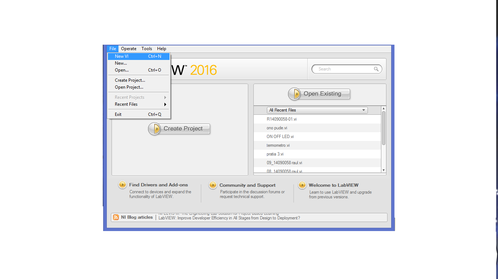
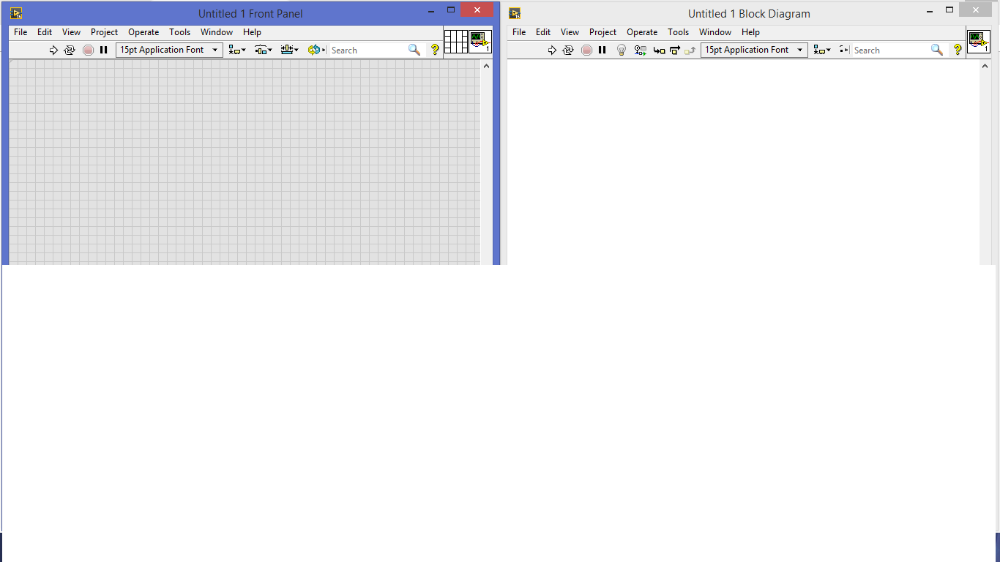

# control-de-procesos-R
practicas de curso julio-agosto 2019
# Tecnologico de estudios superiores de Huixquilucan

### Ingenieria Mecatronica 

### Asignatura. Control de procesos 

### Asesor. Dr Enrique Garcia Trinidad 

### Alumno. Tovar Farfan Raul
### Control de procesos 

# Introduccion al LabVIEW 

LabVIEW (Laboratory Virtual Instrument Engineering Workbench) de National Instruments es
un ambiente de programación basado en programación gráfica y no en texto como lo son
lenguajes de programación tradicionales como C, C++ o java. Labview es un desarrollo de
programación interactivo y un sistema de ejecución diseñado para personas como científicos o
ingenieros que sin ser informáticos necesitan programar como parte de su trabajo. El ambiente
de desarrollo de Labview trabaja sobre computadoras Windows, Mac OS X, o Linux, además se
pueden crear programas que corren en una variedad de plataformas embebidas como FPGAs
(Field Programmable Gate Arrays), DSPs (Digital Signal Processors) y microprocesadores.
Usando el poderoso lenguaje de programación gráfico, Labview puede incrementar la
productividad, programas que toman semanas o meses en ser escritos en lenguajes de
programación convencionales pueden ser completados en horas usando Labview, ya que este
ha sido diseñado específicamente para realizar mediciones, analizar datos, y presentar
resultados al usuario en interfaces gráficas fáciles de programar, es ideal para simulaciones,
presentación de ideas, programación general e incluso para la enseñanza de conceptos básicos
de programación.
La computadora, hardware plug-in y Labview es lo que se necesita para realizar un instrumento
virtual completo, ofreciendo así una alternativa de mayor flexibilidad a los instrumentos
estándares de laboratorio, pues al estar basado en software será cada usuario y no el fabricante
del instrumento el que define la funcionalidad de este y si se necesita cambiar algo simplemente
se modifica el programa.

# Contenido
### Primer programa en labVIEW
Para poder iniciar con la programacion en LabVIEW y comenzar con nuesro primer programa es necesario ir explicando paso a paso los procedimientos a seguir como se muestra a continuacion.

2.-una vez abierto el nuevo VI presionamos Ctrl+T para poder visualizar la parte virtual y la de diagrama de bloques, las cuales utilizaremos para construir mostró programa virtual de esta primer práctica

una vez aqui podemos Visualizar las herramientas que nos ofrece el programa en cada plano de las ventanas y de esta manera empezar a trabajar en el primer programa visualde esta curso.
<img src=

